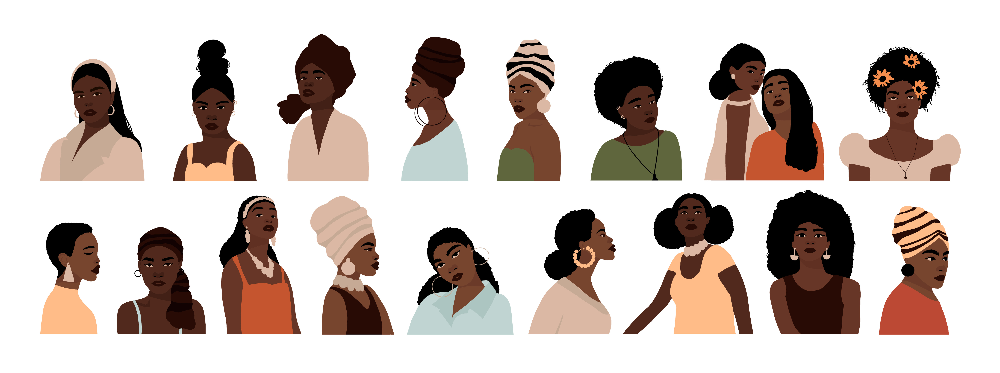

Licensed Photo from [Adobe Stock](https://stock.adobe.com/)

# 65 Inspiring Quotes from Black Women

> A collection of 65 inspiring quotes from Black women. Quotes range from civil-rights icons to writers, singers, poets, politicians, lawyers and influencers. All of these quotes will inspire you and help you seize each day with confidence, courage and self-love.

# Install using npm

```
npm install black-women-inspire
```

# Usage

```
const blackWomenInspire = require('black-women-inspire')

blackWomenInspire.getQuote();
// =>  "Success is liking yourself, liking what you do, and liking how you do it." -  Maya Angelou

blackWomenInspire.getQuote()
// => "Am I good enough? Yes I am." - Michelle Obama

blackWomenInspire.getQuoteAuthorNewLine()
// => "My mission in life is not merely to survive, but to thrive; and to do so with some passion, some compassion, some humor, and some style."
        - Maya Angelou
```

# API

- ```.getQuote()```

Type: `Function`

Random quote with author name.

- ```.getQuoteAuthorNewLine()```

Type: `Function`

Random quote with author name on new line.

# License

MIT © Elisa Bennett
